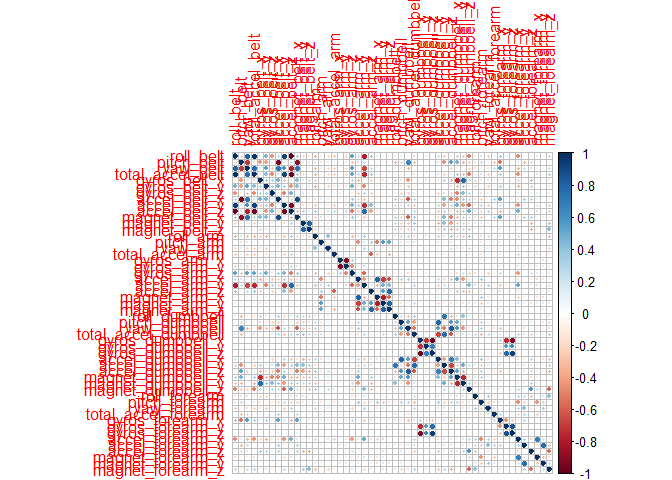

Introduction
------------

Six participants were asked to perform exercises in five different way,
both incorrectly and correctly. I used accelerometer data from the belt,
forearm, arm, and dumbell to train two models to predict the way
exercises were being performed. I tested the models' predictions against
25% of the accellerometer data to pick the best model for making
predictions from the test data.

Further details on the data are available here [linked
page](http://web.archive.org/web/20161224072740/http:/groupware.les.inf.puc-rio.br/har)
.

Work environment
----------------

The details of my R session were

    sessionInfo()

    ## R version 3.5.0 (2018-04-23)
    ## Platform: x86_64-w64-mingw32/x64 (64-bit)
    ## Running under: Windows 10 x64 (build 16299)
    ## 
    ## Matrix products: default
    ## 
    ## locale:
    ## [1] LC_COLLATE=English_United Kingdom.1252 
    ## [2] LC_CTYPE=English_United Kingdom.1252   
    ## [3] LC_MONETARY=English_United Kingdom.1252
    ## [4] LC_NUMERIC=C                           
    ## [5] LC_TIME=English_United Kingdom.1252    
    ## 
    ## attached base packages:
    ## [1] parallel  splines   stats     graphics  grDevices utils     datasets 
    ## [8] methods   base     
    ## 
    ## other attached packages:
    ##  [1] gbm_2.1.3           survival_2.41-3     corrplot_0.84      
    ##  [4] e1071_1.6-8         randomForest_4.6-14 reshape2_1.4.3     
    ##  [7] caret_6.0-79        lattice_0.20-35     lubridate_1.7.4    
    ## [10] ggplot2_2.2.1       rpart.plot_2.1.2    rpart_4.1-13       
    ## 
    ## loaded via a namespace (and not attached):
    ##  [1] Rcpp_0.12.16       tidyr_0.8.0        class_7.3-14      
    ##  [4] assertthat_0.2.0   rprojroot_1.3-2    digest_0.6.15     
    ##  [7] ipred_0.9-6        psych_1.8.3.3      foreach_1.4.4     
    ## [10] R6_2.2.2           plyr_1.8.4         backports_1.1.2   
    ## [13] magic_1.5-8        stats4_3.5.0       evaluate_0.10.1   
    ## [16] pillar_1.2.2       rlang_0.2.0        lazyeval_0.2.1    
    ## [19] kernlab_0.9-26     Matrix_1.2-14      rmarkdown_1.9     
    ## [22] CVST_0.2-1         ddalpha_1.3.3      gower_0.1.2       
    ## [25] stringr_1.3.0      foreign_0.8-70     munsell_0.4.3     
    ## [28] broom_0.4.4        compiler_3.5.0     pkgconfig_2.0.1   
    ## [31] mnormt_1.5-5       dimRed_0.1.0       htmltools_0.3.6   
    ## [34] tidyselect_0.2.4   nnet_7.3-12        tibble_1.4.2      
    ## [37] prodlim_2018.04.18 DRR_0.0.3          codetools_0.2-15  
    ## [40] RcppRoll_0.2.2     withr_2.1.2        dplyr_0.7.4       
    ## [43] MASS_7.3-49        recipes_0.1.2      ModelMetrics_1.1.0
    ## [46] grid_3.5.0         nlme_3.1-137       gtable_0.2.0      
    ## [49] magrittr_1.5       scales_0.5.0       stringi_1.1.7     
    ## [52] bindrcpp_0.2.2     timeDate_3043.102  robustbase_0.93-0 
    ## [55] geometry_0.3-6     lava_1.6.1         iterators_1.0.9   
    ## [58] tools_3.5.0        glue_1.2.0         DEoptimR_1.0-8    
    ## [61] purrr_0.2.4        sfsmisc_1.1-2      abind_1.4-5       
    ## [64] yaml_2.1.19        colorspace_1.3-2   knitr_1.20        
    ## [67] bindr_0.1.1

To make the work reproducable, I set a random seed

    set.seed(1234)

Importing data
--------------

    urlTraining <- "https://d396qusza40orc.cloudfront.net/predmachlearn/pml-training.csv"
    urlTesting <- "https://d396qusza40orc.cloudfront.net/predmachlearn/pml-testing.csv"

    Training_data <- read.csv(url(urlTraining))
    Testing_data <- read.csv(url(urlTesting))

Partition data
--------------

For model selection and validation purposes the training data was split
into a training and validation set

    inTrain <- createDataPartition(Training_data$classe,p=0.75, list = FALSE)

    Validation_data<- Training_data[-inTrain,]
    Training_data <- Training_data[inTrain,]

Cleaning the data
-----------------

I removed identifier variables, variables with near-zero variance, and
variables with mostly null values.

    Training_data <- Training_data[,-(1:5)]
    Testing_data <- Testing_data[,-(1:5)] 
    Validation_data <- Validation_data[,-(1:5)]

    remove_variables <- nearZeroVar(Training_data)
    Training_data <- Training_data[,-remove_variables]
    Testing_data <- Testing_data[,-remove_variables]
    Validation_data <- Validation_data[,-remove_variables]

    remove_NA_variables <- sapply(Training_data, function (x) {sum(is.na(x)) > (nrow(Training_data) *0.9)})
    Training_data <- Training_data[,!remove_NA_variables]
    Testing_data <- Testing_data[,!remove_NA_variables]
    Validation_data <- Validation_data[,!remove_NA_variables]

Preprocessing
-------------

I centred and scaled the data using caret's preProcess function

    preObj<- preProcess(Training_data[,2:53])
    Training_data[,2:53] <- predict(preObj, newdata= Training_data[,2:53])
    Validation_data[,2:53] <- predict(preObj, newdata = Validation_data[,2:53])
    Testing_data[,2:53] <- predict(preObj, newdata = Testing_data[,2:53])

Check the traiing data for highly correlated variables with the corrplot
package

Several variables are highly correlated. I could use PCA to create new
features, but it tends not to make large differences to predictions for
decision tree type models.

### Train a random forest Model

I used the "randomForest"" method from the package "randomForest""
rather than using caret's "rf" method due to the excessive computation
time for the "rf" method.

    setwd("C:/Users/jonat/Documents/Coursera/Data Science/8.Practical Machine Learning")
    if(exists ("RF_model_fit.Rda")) {
      RF_model_fit <- load("RF_model_fit.Rda")
        } else {
    x1 = Training_data[,1:53]
    y2 = Training_data[,54]
    RF_model_fit <- randomForest(x= x1,y = y2 , na.action = na.omit)
    save(RF_model_fit, file = "RF_model_fit.Rda")}

Train a gradient boosted model
------------------------------

    setwd("C:/Users/jonat/Documents/Coursera/Data Science/8.Practical Machine Learning")

    if (exists("gbm_model.Rda")) {
      gbm_model<-load("gbm_model.Rda")} else {
    gbm_model<- gbm(classe~., data = Training_data, n.trees = 300)
      save(gbm_model, file = "gbm_model.Rda")}

    ## Distribution not specified, assuming multinomial ...

Model selection
---------------

I selected which of the two models to use for predicting the test set
outcomes by compaing the OOB accuracies of the two models.

    x2<-Validation_data[,1:53]
    y2<- Validation_data[,54]
      
    RF_OOB_confusion<- confusionMatrix(predict(RF_model_fit,                                    newdata=x2),y2)

    gbm_model_confusion <- confusionMatrix(factor(apply(predict(gbm_model, newdata = Validation_data[,1:53], n.trees = 300, type = 'response'),1,which.max), labels = c("A","B","C","D","E")),Validation_data$classe)

The random forest model had an accuracy of 0.9974206 compared to the
gradient boosted model's accuract of 0.3931858.

The random forest model was more accurate, so I chose to use it for my
final predictions.

Predictions
-----------

I used the random forest model to predict the outcomes of the test set
data.

    predictions <- predict(RF_model_fit, newdata = Testing_data[,1:53])
    print(predictions)

    ##  1  2  3  4  5  6  7  8  9 10 11 12 13 14 15 16 17 18 19 20 
    ##  B  A  B  A  A  E  D  B  A  A  B  C  B  A  E  E  A  B  B  B 
    ## Levels: A B C D E
